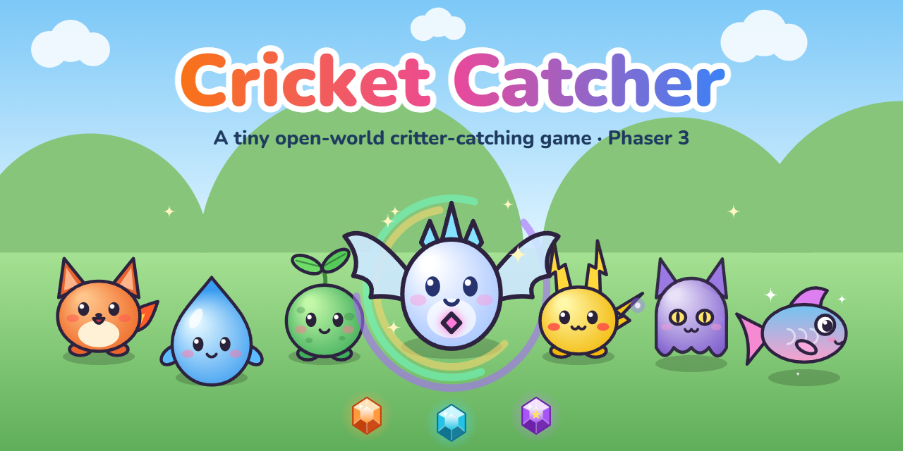
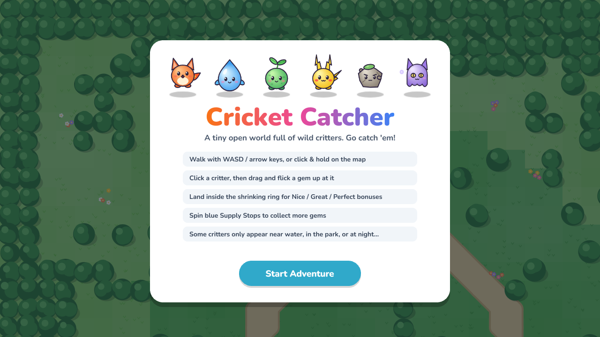
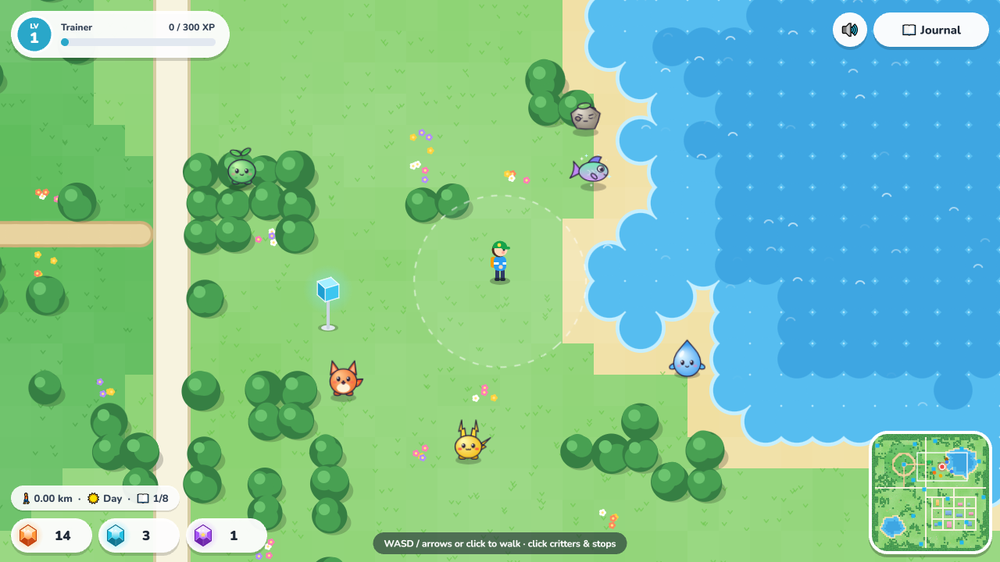
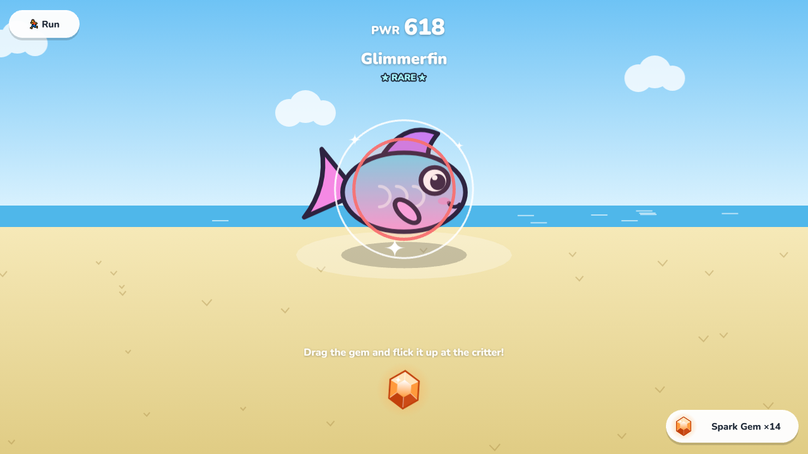
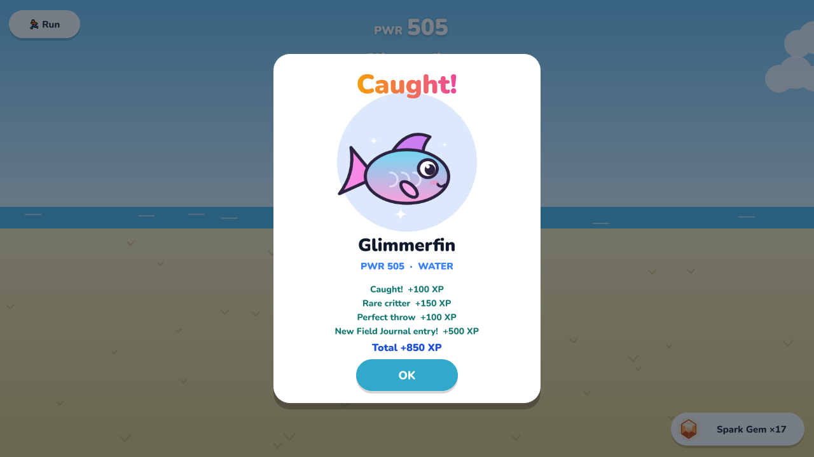
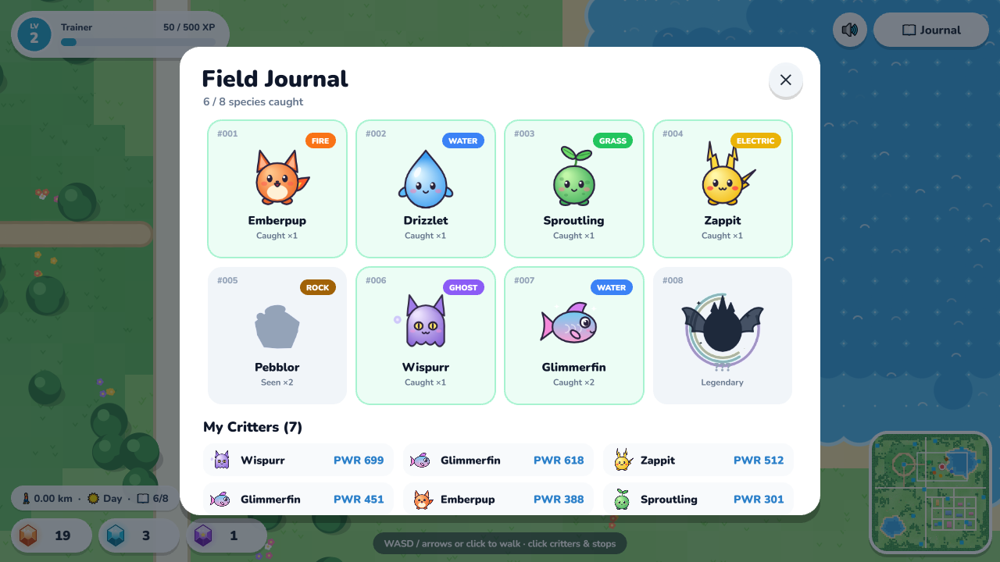
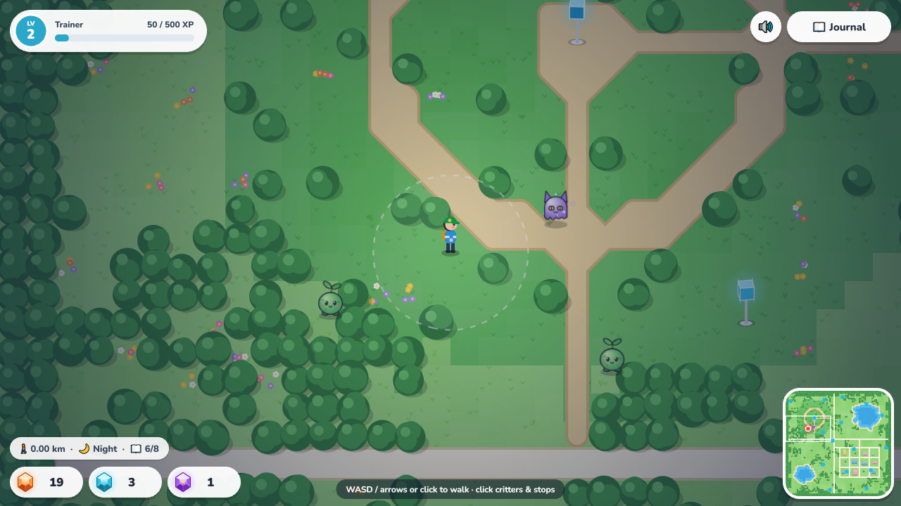

# 🦗 Cricket Catcher



### _A Personal Game Dev Project_

**Cricket Catcher** is a small open-world creature-catching game built with the **Phaser 3** engine. You explore a top-down map with a park, lakes and a little town. Along the way you find wild critters, flick capture gems at them, and fill your Field Journal.

The project was built to explore **procedural art** (the game loads zero image or audio files), **runtime spritesheet generation**, **tile-based pathfinding** and **multi-scene game architecture** in Phaser.

---

## 🖼️ Gallery

|                    Title Screen                    |                     Exploring the World                     |
| :------------------------------------------------: | :---------------------------------------------------------: |
|             |                |
|      _Animated critter parade over the real map_      |    _Lakeside spawns, Supply Stop, minimap and gem bag_     |

|                  Catch Encounter                   |                       Caught!                       |
| :------------------------------------------------: | :-------------------------------------------------: |
|      |              |
|  _The ring color shows your odds and shrinks over time_  |     _A Perfect throw on a rare Glimmerfin, with XP breakdown_      |

|                   Field Journal                    |                       Night Time                        |
| :------------------------------------------------: | :-----------------------------------------------------: |
|        |                    |
|   _Seen vs. caught species and your strongest critters_   |   _Day/night cycle: ghost-type Wispurr comes out at night_   |

---

## 🎮 How to Play

| Action | Control |
| :--- | :--- |
| Walk | `WASD` / arrow keys, or click (or hold) on the map |
| Encounter a critter | Click it (you walk over automatically if it's far away) |
| Throw a gem | Drag the gem and **flick it upward** at the critter |
| Spin a Supply Stop | Click a blue cube to collect more gems |
| Open the Field Journal | `📖 Journal` button or `J` |
| Run from an encounter / close menus | `🏃 Run` button or `Esc` |

**Tips**

- Land the gem inside the **shrinking ring** for a _Nice_, _Great_ or _Perfect_ bonus. A smaller ring gives a bigger bonus.
- The ring color shows your odds: 🟢 easy, 🟡 medium, 🟠 hard, 🔴 very hard.
- Better gems (Glow, Star) raise your catch chance.
- Where you are matters. Water critters live near the lakes, grass critters in the park, electric critters in town, and some only come out **at night**.

---

## 🚀 Features

- **Open World:** a 3000×3000 px map generated from a fixed seed. It has a park with dirt trails, two lakes with sandy shores, a town grid with buildings, and forest around the edges. A live minimap sits in the corner.
- **Click-to-Walk Pathfinding:** a breadth-first search over the tile grid, with path smoothing, so the trainer walks around trees, water and buildings instead of getting stuck.
- **8 Original Critters:** each one is drawn entirely in code and baked into a **32-frame looping spritesheet** when the game loads. Rarity runs from Common to Legendary.
- **Biome & Time-Based Spawning:** each species has spawn weights per biome (field, park, shore, town). Ghost types appear more often at night, and the legendary only appears once you reach level 3.
- **Flick-to-Throw Catching:** your flick speed sets how far the gem flies, and its direction sets where it lands. A catch rolls three "pulses", each with its own chance to break free, and critters can run away.
- **Day/Night Cycle:** a 4-minute cycle with a soft light around the trainer at night.
- **Progression:** you earn XP and level up, and each level-up gives a gem reward. Supply Stops recharge after use, and the Field Journal tracks seen and caught species plus your strongest catches.
- **Synthesized Sound:** every sound effect is generated live with the Web Audio API, with no audio files.
- **Auto-Save:** progress is saved to `localStorage` and survives page reloads.

---

## 🐾 The Critters

| # | Name | Type | Rarity | Found |
| :-: | :--- | :--- | :--- | :--- |
| 001 | Emberpup | Fire | Common | Fields & town |
| 002 | Drizzlet | Water | Common | Near the lakes |
| 003 | Sproutling | Grass | Common | The park |
| 004 | Zappit | Electric | Uncommon | Town |
| 005 | Pebblor | Rock | Uncommon | Open fields |
| 006 | Wispurr | Ghost | Rare | Anywhere, mostly at night |
| 007 | Glimmerfin | Water | Rare | Lake shores only |
| 008 | Aurorex | Cosmic | Legendary | ??? (level 3+) |

---

## 🛠️ Tech Stack

- **Engine:** Phaser 3.88.2
- **Language:** Vanilla JavaScript (ES modules, no build step)
- **Graphics:** Canvas 2D drawing, turned into Phaser `CanvasTexture` spritesheets and animations
- **Effects:** Phaser tweens and particle emitters
- **Audio:** Web Audio API (oscillators and gain envelopes)
- **Storage:** `localStorage`
- **Font:** Nunito (Google Fonts)

---

## 📂 Project Structure

```
cricket-catcher/
├── index.html            # Page shell, loads Phaser + src/main.js
├── phaser.js             # Phaser 3 engine
├── thumbnail.png         # Project thumbnail (Phaser Editor)
├── screenshots/          # README gallery images (not used by the game)
└── src/
    ├── main.js           # Game config & scene list
    ├── config.js         # Tuning values, rarities, gems, throw bonuses
    ├── species.js        # The 8 critters and their spawn biomes
    ├── art.js            # All procedural drawing (critters, gems, trainer, cube)
    ├── textures.js       # Bakes the art into spritesheets & animations at boot
    ├── world.js          # Seeded map generation, rendering & pathfinding
    ├── player.js         # Trainer movement, collision, click-to-walk
    ├── state.js          # Save data, XP/levels, day/night clock
    ├── sound.js          # Web Audio sound effects
    ├── ui.js             # Buttons, pills, toast notifications
    ├── util.js           # Math helpers & seeded random
    └── scenes/
        ├── BootScene.js       # Generates the world and all textures
        ├── TitleScene.js      # Start menu
        ├── WorldScene.js      # Exploration, spawning, supply stops
        ├── UIScene.js         # HUD, minimap, Field Journal
        └── EncounterScene.js  # Catch screen
```

---

## ▶️ Running Locally

The game uses ES modules, so it has to be served over HTTP. Opening `index.html` directly from the file system won't work.

**Option 1: Python**

```bash
cd cricket-catcher
python -m http.server 8000
```

Then open <http://localhost:8000>.

**Option 2:** use the **Live Server** extension in VS Code, or the **Play** button in Phaser Editor.

> 💡 To reset your progress, run `localStorage.removeItem('cricketCatcher.v1')` in the browser console.

---

## 📝 Notes

All characters, art, names and sounds in this project are original and generated in code. The game is a personal, non-commercial learning project, inspired by location-based creature-catching games.

---

## 📄 License

Copyright © 2026 Wilfredo Domanico. All rights reserved.

This source code is shared for demonstration and portfolio purposes only. See [LICENSE](LICENSE) for details.

The bundled `phaser.js` is the [Phaser](https://phaser.io) game framework, © Phaser Studio Inc., and is distributed under its own MIT license.
